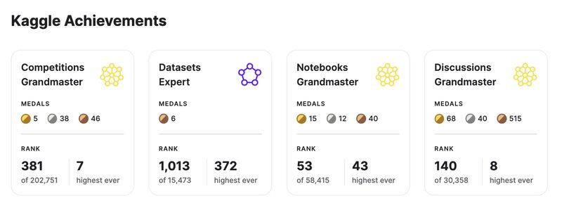
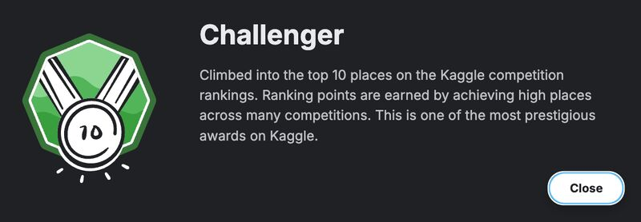

# Kaggle Public Notebooks by Luca Massaron

This repository contains a collection of Kaggle notebooks by [Luca Massaron](https://www.kaggle.com/lucamassaron).

## About the Author

Luca Massaron is a Kaggle Grandmaster in discussions and a Master in competitions and notebooks, having reached a peak worldwide ranking of 7th. He is also a Google Developer Expert in AI/ML.

Professionally, Luca is a Data Science & Modelling Senior Expert at illimity Bank, where he develops models for risk, credit rating, loss prediction, and fraud detection. He has over a decade of experience in the field.

He is a prolific author of books on data science, artificial intelligence, and machine learning, including several popular titles in the "For Dummies" series. Some of his books include "The Kaggle Book," "Machine Learning for Tabular Data," and "Artificial Intelligence For Dummies".

## Achievements

Here are some of Luca's achievements on Kaggle:

## Notebooks

Here is a list of the notebooks in this repository, with links to their Kaggle versions and a short description of each:

| Notebook Name | Kaggle Link | Description |
|---|---|---|
| Adversarial Validation of Label Inversions | [Link](https://www.kaggle.com/code/lucamassaron/adversarial-validation-of-label-inversions) | A notebook demonstrating how to use adversarial validation to detect label inversions in a dataset. |
| Applied Bayesian Optimization with XGBoost | [Link](https://www.kaggle.com/code/lucamassaron/applied-bayesian-optimization-with-xgboost) | This notebook explains how to use Bayesian optimization to tune the hyperparameters of an XGBoost model. |
| Are You Doing Cross-Validation the Best Way? | [Link](https://www.kaggle.com/code/lucamassaron/are-you-doing-cross-validation-the-best-way) | A notebook that discusses different cross-validation strategies and how to choose the best one for your problem. |
| Autogluon for Tabular Playground Sep 2021 | [Link](https://www.kaggle.com/code/lucamassaron/autogluon-for-tabular-playground-sep-2021) | This notebook shows how to use AutoGluon for a tabular competition, demonstrating its power and ease of use. |
| Baseline LightGBM with Covtype Augmentation | [Link](https://www.kaggle.com/code/lucamassaron/baseline-lightgbm-with-covtype-augmentation) | A notebook that provides a LightGBM baseline for the Cover Type dataset, with a focus on data augmentation. |
| Basic EDA and Model to Start | [Link](https://www.kaggle.com/code/lucamassaron/basic-eda-and-model-to-start) | This notebook provides a basic exploratory data analysis (EDA) and a starting model for a competition. |
| Categorical Feature Encoding with TensorFlow | [Link](https://www.kaggle.com/code/lucamassaron/categorical-feature-encoding-with-tensorflow) | A notebook that demonstrates various techniques for encoding categorical features using TensorFlow. |
| Data Science AI Assistant with Gemma 2B IT | [Link](https://www.kaggle.com/code/lucamassaron/data-science-ai-assistant-with-gemma-2b-it) | This notebook showcases how to build a data science AI assistant using the Gemma 2B IT model. |
| Deep Learning for Tabular Data | [Link](https://www.kaggle.com/code/lucamassaron/deep-learning-for-tabular-data) | A notebook that explores the use of deep learning models for tabular data, providing a comprehensive overview. |
| Easy Peasy EDA XGBoost is All You Need | [Link](https://www.kaggle.com/code/lucamassaron/easy-peasy-eda-xgboost-is-all-you-need) | This notebook provides a simple and effective EDA and an XGBoost model for a competition. |
| EDA Target Analysis | [Link](https://www.kaggle.com/code/lucamassaron/eda-target-analysis) | A notebook that focuses on the analysis of the target variable in a dataset, a crucial step in any machine learning project. |
| Feature Selection by Boruta SHAP for Ubiquant | [Link](https://www.kaggle.com/code/lucamassaron/feature-selection-by-boruta-shap-for-ubiquant) | This notebook demonstrates how to use the Boruta-SHAP package for feature selection in the Ubiquant competition. |
| Feature Selection by Boruta SHAP | [Link](https://www.kaggle.com/code/lucamassaron/feature-selection-by-boruta-shap) | A notebook that explains and applies the Boruta-SHAP method for feature selection. |
| Feature Selection using Boruta SHAP | [Link](https://www.kaggle.com/code/lucamassaron/feature-selection-using-boruta-shap) | This notebook provides a practical example of using Boruta-SHAP for feature selection. |
| Feature Selection with Boruta SHAP | [Link](https://www.kaggle.com/code/lucamassaron/feature-selection-with-boruta-shap) | A notebook that demonstrates the use of the Boruta-SHAP package for feature selection. |
| Festivities in Finland, Norway, Sweden | [Link](https://www.kaggle.com/code/lucamassaron/festivities-in-finland-norway-sweden) | This notebook explores the festive seasons in Finland, Norway, and Sweden using data analysis. |
| Fine-Tune Gemma 7B for Sentiment Analysis | [Link](https://www.kaggle.com/code/lucamassaron/fine-tune-gemma-7b-for-sentiment-analysis) | A notebook that shows how to fine-tune the Gemma 7B model for sentiment analysis. |
| Fine-Tune Gemma 7B IT for Sentiment Analysis | [Link](https://www.kaggle.com/code/lucamassaron/fine-tune-gemma-7b-it-for-sentiment-analysis) | This notebook demonstrates how to fine-tune the Gemma 7B IT model for sentiment analysis. |
| Fine-Tune Gemma 7B IT for Sentiment Analysis TPU | [Link](https://www.kaggle.com/code/lucamassaron/fine-tune-gemma-7b-it-for-sentiment-analysis-tpu) | A notebook that shows how to fine-tune the Gemma 7B IT model for sentiment analysis using a TPU. |
| Fine-Tune Llama 2 for Sentiment Analysis | [Link](https://www.kaggle.com/code/lucamassaron/fine-tune-llama-2-for-sentiment-analysis) | This notebook provides a guide on how to fine-tune the Llama 2 model for sentiment analysis. |
| Fine-Tune Llama 3 for Sentiment Analysis | [Link](https://www.kaggle.com/code/lucamassaron/fine-tune-llama-3-for-sentiment-analysis) | A notebook that demonstrates how to fine-tune the Llama 3 model for sentiment analysis. |
| Fine-Tune Mistral v0 2 for Sentiment Analysis | [Link](https://www.kaggle.com/code/lucamassaron/fine-tune-mistral-v0-2-for-sentiment-analysis) | This notebook shows how to fine-tune the Mistral v0.2 model for sentiment analysis. |
| Fine-Tune ModernBERT for Sentiment Analys | [Link](https://www.kaggle.com/code/lucamassaron/fine-tune-modernbert-for-sentiment-analys) | A notebook that demonstrates how to fine-tune the ModernBERT model for sentiment analysis. |
| Fine-Tune Phi 2 for Sentiment Analysis | [Link](https://www.kaggle.com/code/lucamassaron/fine-tune-phi-2-for-sentiment-analysis) | This notebook provides a guide on how to fine-tune the Phi 2 model for sentiment analysis. |
| Fine-Tune Phi 3 for Sentiment Analysis | [Link](https://www.kaggle.com/code/lucamassaron/fine-tune-phi-3-for-sentiment-analysis) | A notebook that demonstrates how to fine-tune the Phi 3 model for sentiment analysis. |
| Gemma 2 2B Learns How to Tutor in AI ML | [Link](https://www.kaggle.com/code/lucamassaron/gemma-2-2b-learns-how-to-tutor-in-ai-ml) | This notebook showcases how to use the Gemma 2 2B model to create an AI/ML tutor. |
| Hacking Bayesian Optimization | [Link](https://www.kaggle.com/code/lucamassaron/hacking-bayesian-optimization) | A notebook that provides a deep dive into Bayesian optimization, with practical tips and tricks. |
| How to Use CTGAN to Generate More Data | [Link](https://www.kaggle.com/code/lucamassaron/how-to-use-ctgan-to-generate-more-data) | This notebook explains how to use Conditional Tabular GAN (CTGAN) to generate synthetic tabular data. |
| Interesting EDA, t-SNE, UMAP | [Link](https://www.kaggle.com/code/lucamassaron/interesting-eda-tsne-umap) | A notebook that demonstrates the use of t-SNE and UMAP for exploratory data analysis. |
| Kaggle Days Paris GBDT Workshop | [Link](https://www.kaggle.com/code/lucamassaron/kaggle-days-paris-gbdt-workshop) | This notebook contains the materials for a workshop on Gradient Boosting Decision Trees (GBDT) from Kaggle Days Paris. |
| Kaggle Merchandise EDA with Baseline Linear Model | [Link](https://www.kaggle.com/code/lucamassaron/kaggle-merchandise-eda-with-baseline-linear-model) | A notebook that performs an EDA on the Kaggle merchandise dataset and provides a baseline linear model. |
| KerasTuner for IMDB | [Link](https://www.kaggle.com/code/lucamassaron/kerastuner-for-imdb) | This notebook shows how to use KerasTuner to tune the hyperparameters of a model for the IMDB dataset. |
| LSTM Baseline for Sentiment Analysis | [Link](https://www.kaggle.com/code/lucamassaron/lstm-baseline-for-sentiment-analysis) | A notebook that provides an LSTM baseline for sentiment analysis. |
| Meta-Features and Target Encoding | [Link](https://www.kaggle.com/code/lucamassaron/meta-features-and-target-encoding) | This notebook explores the use of meta-features and target encoding for feature engineering. |
| Normalization vs. Standardization | [Link](https://www.kaggle.com/code/lucamassaron/normalization-vs-standardization) | A notebook that explains the difference between normalization and standardization and when to use each. |
| Really Not Missing at Random | [Link](https://www.kaggle.com/code/lucamassaron/really-not-missing-at-random) | This notebook discusses the concept of missing data and how to handle it when it is not missing at random. |
| Rescaling Layer for Discrete Output in TensorFlow | [Link](https://www.kaggle.com/code/lucamassaron/rescaling-layer-for-discrete-output-in-tensorflow) | A notebook that shows how to use a rescaling layer in TensorFlow for discrete output. |
| Scikit-Optimize for LightGBM | [Link](https://www.kaggle.com/code/lucamassaron/scikit-optimize-for-lightgbm) | This notebook demonstrates how to use Scikit-Optimize to tune the hyperparameters of a LightGBM model. |
| Sherlock Holmes Q&A with Gemma Fine-Tuning | [Link](https://www.kaggle.com/code/lucamassaron/sherlock-holmes-q-a-with-gemma-fine-tuning) | A notebook that shows how to fine-tune a Gemma model to answer questions about Sherlock Holmes. |
| Skopt for LightGBM | [Link](https://www.kaggle.com/code/lucamassaron/skopt-for-lightgbm) | This notebook demonstrates how to use Scikit-Optimize (skopt) to tune the hyperparameters of a LightGBM model. |
| Steel Plate EDA, XGBoost is All You Need | [Link](https://www.kaggle.com/code/lucamassaron/steel-plate-eda-xgboost-is-all-you-need) | This notebook provides an EDA and an XGBoost model for the steel plate defects dataset. |
| t-SNE and UMAP for EDA | [Link](https://www.kaggle.com/code/lucamassaron/t-sne-and-umap-for-eda) | A notebook that demonstrates the use of t-SNE and UMAP for exploratory data analysis. |
| TFKeras DNN with Multiclass Focal Loss | [Link](https://www.kaggle.com/code/lucamassaron/tfkeras-dnn-with-multiclass-focal-loss) | This notebook shows how to build a Deep Neural Network (DNN) with TensorFlow/Keras and use a multiclass focal loss. |
| Tutorial Bayesian Optimization with CatBoost | [Link](https://www.kaggle.com/code/lucamassaron/tutorial-bayesian-optimization-with-catboost) | A notebook that provides a tutorial on how to use Bayesian optimization with CatBoost. |
| Tutorial Bayesian Optimization with LightGBM | [Link](https://www.kaggle.com/code/lucamassaron/tutorial-bayesian-optimization-with-lightgbm) | This notebook provides a tutorial on how to use Bayesian optimization with LightGBM. |
| Tutorial Bayesian Optimization with XGBoost | [Link](https://www.kaggle.com/code/lucamassaron/tutorial-bayesian-optimization-with-xgboost) | A notebook that provides a tutorial on how to use Bayesian optimization with XGBoost. |
| Tutorial Feature Selection with Boruta SHAP | [Link](https://www.kaggle.com/code/lucamassaron/tutorial-feature-selection-with-boruta-shap) | This notebook provides a tutorial on how to use the Boruta-SHAP package for feature selection. |
| Tutorial TensorFlow 2.x for Tabular Data | [Link](https://www.kaggle.com/code/lucamassaron/tutorial-tensorflow-2-x-for-tabular-data) | A notebook that provides a tutorial on how to use TensorFlow 2.x for tabular data. |
| Tweedie Regression for 30 Days of ML | [Link](https://www.kaggle.com/code/lucamassaron/tweedie-regression-for-30-days-of-ml) | This notebook demonstrates how to use Tweedie regression for the 30 Days of ML competition. |
| Workbook DAE | [Link](https://www.kaggle.com/code/lucamassaron/workbook-dae) | A notebook that provides a workbook for a Denoising Autoencoder (DAE). |
| XGBoost for Tabular Data | [Link](https://www.kaggle.com/code/lucamassaron/xgboost-for-tabular-data) | This notebook provides a comprehensive guide to using XGBoost for tabular data. |